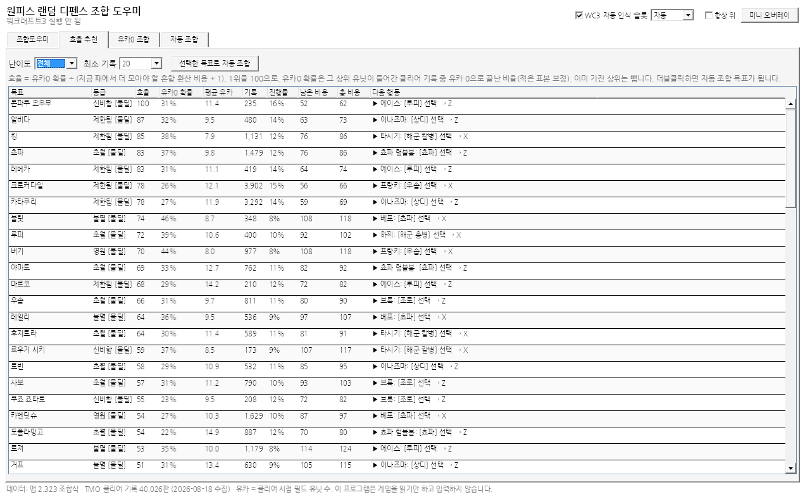
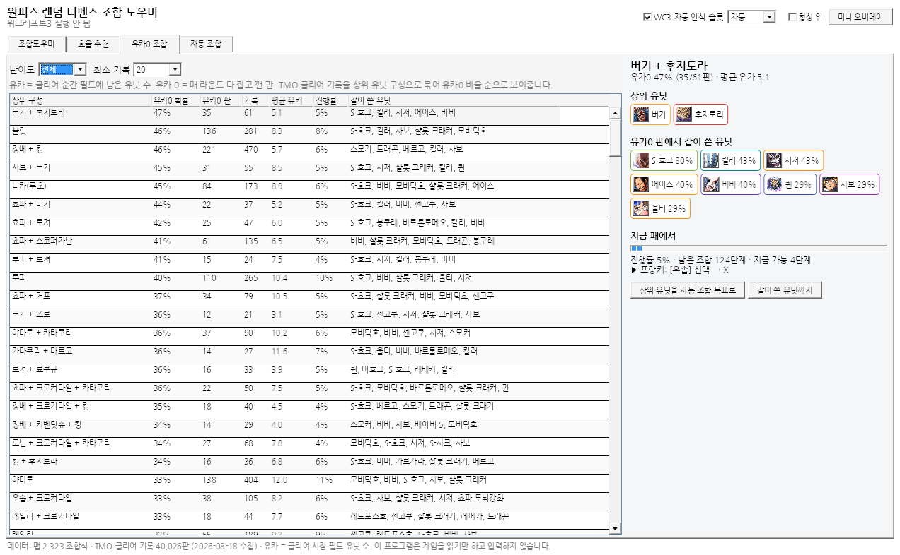

# 원랜디 조합 도우미

워크래프트3 유즈맵 **원피스 랜덤 디펜스(원랜디)** 조합 도우미입니다.
워크3를 켜면 내 패를 자동으로 읽고, OX 조합기·TMO 조합도우미처럼 전 유닛을 보여주면서
**효율 좋은 목표**, **유카0을 볼 수 있는 조합**, **지금 누를 조합 키**를 알려줍니다.

> 게임을 **읽기만** 합니다. 메모리 쓰기·주입·키 입력 대행은 하지 않습니다. 조합 키는 직접 누르세요.

## 탭

| 탭 | 내용 |
|---|---|
| **조합도우미** | 전 유닛을 등급·딜 타입별 열로 펼친 OX 조합기 형식. 체크 = 보유, 줄 클릭 +1 / 우클릭 −1. 금색 = 지금 조합 가능. 유닛을 누르면 조합 트리(✔/✘), 단축키·채팅 명령, 재료로 쓰이는 곳, 패 능력치 합계 |
| **효율 추천** | 상위 유닛별 `효율 = 유카0 확률 ÷ (지금 패에서 더 모아야 할 흔함 환산 비용 + 1)`. 진행률·남은 비용·다음 행동 |
| **유카0 조합** | TMO 클리어 기록 40,026판을 상위 구성(예: 징베 + 킹)으로 묶어 유카0 비율 순으로. 유카0 판에서 같이 쓴 유닛과 지금 패의 진행률 |
| **자동 조합** | 목표(직접 고르거나 효율 1위 자동)까지의 조합 순서를 패가 바뀔 때마다 다시 계산. `[루피] 선택 → Z` 처럼 지금 할 조합을 위에서부터. **미니 오버레이**로 게임 위에 띄우기 |

**유카** = 클리어 순간 필드에 남은 적 유닛 수. 유카 0 = 매 라운드를 다 잡고 깬 판입니다.






## 사용법

1. [Actions](../../actions) 또는 Releases에서 `OrdHelper-win-x64.zip`을 받아 압축을 풀고 `OrdHelper.exe` 실행 (Windows 10/11 x64, 설치 불필요).
2. 워크래프트3에서 원랜디를 시작하면 상단에 `WC3 … · 1P · 유닛 N`이 뜨고 패가 자동으로 채워집니다.
   - 내 플레이어 번호가 1P가 아니면 상단 **슬롯**에서 고르세요.
   - 인식이 안 되거나 틀리면 **WC3 자동 인식**을 끄고 조합도우미 탭에서 직접 O/X로 찍으면 됩니다.
3. 게임 중에는 **미니 오버레이**(드래그로 이동, 우클릭 닫기)를 켜 두고, 워크3는 *창 모드* 또는 *전체 창 모드*로 실행하세요.

### 워크3 인식 지원 범위

| 워크3 빌드 | 상태 |
|---|---|
| 2.0.4.23745 | 참고 저장소에서 검증된 배치 + 로컬 플레이어 자동 판별 |
| 3.0.0.24268 | 실측 배치(유닛 풀 +0xC08/+0xC10). 로컬 슬롯은 **슬롯** 설정 사용 |
| 그 밖 | 위 두 배치를 차례로 시도(실험). 상태줄에 `미검증 빌드` 표시 |

`Warcraft III.exe`가 관리자 권한으로 실행 중이면 이 프로그램도 관리자 권한으로 실행해야 읽을 수 있습니다.

## 빌드

```bash
dotnet test tests/OrdHelper.Core.Tests          # 조합/통계 로직 (모든 OS)
dotnet publish src/OrdHelper.App -c Release -r win-x64 --self-contained true -o publish
```

UI는 XAML 없이 코드로만 작성해 리눅스에서도 컴파일됩니다(`EnableWindowsTargeting`). 실행은 Windows 전용.

데이터 갱신: `python3 tools/build_data.py <onepiece-random-defense-overlay>/Data` → `Data/ord-data.json`, `Data/images/` 재생성.

## 구조

```
src/OrdHelper.Core   데이터 로드, 조합 계획(Crafting), 효율·유카0 통계(Insights), RTTI 파서
src/OrdHelper.App    WPF 화면 4탭 + 미니 오버레이, 워크3 읽기 전용 리더(Wc3Reader)
tests/               xUnit
tools/build_data.py  참고 저장소 Data → Data/ord-data.json
```

## 알려진 한계

- 흔함 환산 비용은 등급별 어림값(조합식 없는 특별함·희귀함 = 4, 랜덤유닛 = 4 등)입니다.
- 아이템·상위 수 제한·동시 보유 금지·랜덤전용 선택 같은 조건은 자동 판정하지 않고 "조건"으로 안내만 합니다.
- 클리어 기록은 2026-08-18 기준 14일치 TMO 공개 기록이며, 신·악몽·지옥 클리어 판만 포함합니다.
- 능력치 합계는 TMO 조합도우미 표기값의 단순 합(중첩 규칙 미반영)입니다.

## 고지

비공식 팬 도구입니다. 원피스 랜덤 디펜스 제작진, 티모지지(TMO.GG)와 관련이 없습니다.
데이터·리더 알고리즘 출처와 라이선스는 [NOTICE.md](NOTICE.md)를 보세요. 라이선스: [MIT](LICENSE)
