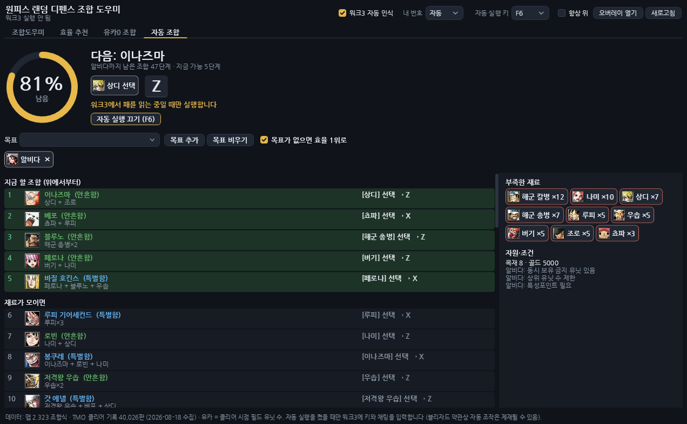
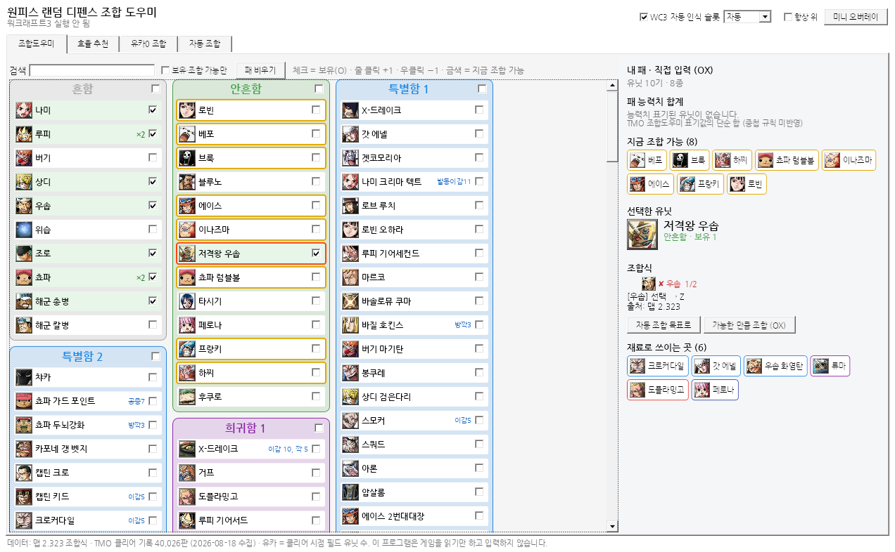

# 원랜디 조합 도우미

워크래프트3 유즈맵 **원피스 랜덤 디펜스(원랜디)** 조합 도우미입니다.
워크3를 켜면 내 패를 자동으로 읽고, OX 조합기처럼 전 유닛을 보여주면서
**효율 좋은 목표**, **유카0을 볼 수 있는 조합**, **목표까지 남은 %** 를 알려주고,
켜 두면 **조합을 자동으로 실행**합니다.

## 탭

| 탭 | 내용 |
|---|---|
| **조합도우미** | 전 유닛을 등급·딜 타입별 열로 펼친 OX 조합기 형식. 체크 = 보유, 줄 클릭 +1 / 우클릭 −1, 금색 테두리 = 지금 조합 가능. 유닛을 누르면 조합 트리(✔/✘), 단축키·채팅 명령, 재료로 쓰이는 곳, 패 능력치 합계 |
| **효율 추천** | 상위 유닛별 `효율 = 유카0 확률 ÷ (지금 패에서 더 모아야 할 흔함 환산 비용 + 1)`. 남은 %·남은 비용·다음 행동 |
| **유카0 조합** | TMO 클리어 기록 40,026판을 상위 구성(예: 징베 + 킹)으로 묶어 유카0 비율 순으로. 유카0 판에서 같이 쓴 유닛과 남은 % 링 |
| **자동 조합** | 남은 % 링과 다음 행동(키캡)을 크게. 목표(직접 고르거나 효율 1위 자동)까지의 조합 순서를 패가 바뀔 때마다 다시 계산. **자동 실행**과 **미니 오버레이** |

**유카** = 클리어 순간 필드에 남은 적 유닛 수. 유카 0 = 매 라운드를 다 잡고 깬 판입니다.




## 자동 실행

상단 **자동 실행 키**(기본 F6)를 게임 중에 누르면 켜지고, 다시 누르면 꺼집니다.

| 조합 종류 | 프로그램이 하는 일 |
|---|---|
| 채팅 조합 (히든·초월·불멸·영원 등 81개) | 워크3 창이 앞에 있으면 명령어(예: `akainu tr`)를 직접 입력합니다. 유닛을 선택할 필요가 없습니다. |
| 단축키 조합 (156개) | 오버레이에 나온 유닛(예: 루피)을 **클릭만 하면** 조합 키(Z/X/C/B)를 대신 누릅니다. |
| 대상 지정형 (유카리·요우무 등 6개) | 랜덤전용 유닛을 클릭해야 해서 직접 하도록 안내합니다. |

- 실행할 때마다 워크3 패에서 결과 유닛이 늘었는지 확인한 뒤 다음 단계로 넘어갑니다.
- 확인이 안 되면 워크3 연결을 새로고침하고 한 번 더 시도하고, 같은 단계가 두 번 실패하면 멈추고 이유를 알려 줍니다.
- 워크3가 맨 앞 창이 아니면 아무것도 입력하지 않습니다. 채팅은 유니코드로 보내서 한/영 상태와 상관없습니다.
- 유닛을 프로그램이 직접 고르지 못하는 이유: 화면 속 유닛 위치를 계산하려면 카메라 정보를 메모리에서 읽어야 하는데, 지금 워크3 빌드에서는 그 위치가 밝혀져 있지 않습니다.

> **주의**: 블리자드 약관은 허가받지 않은 자동 조작 프로그램("봇")을 금지합니다. 자동 실행은 본인 판단과 책임으로 켜세요. 끄면 게임을 읽기만 합니다.

## 사용법

1. [Actions](../../actions) 또는 Releases에서 `OrdHelper-win-x64.zip`을 받아 압축을 풀고 `OrdHelper.exe` 실행 (Windows 10/11 x64, 설치 불필요).
2. 워크래프트3에서 원랜디를 시작하면 상단에 `WC3 … · 1P · 유닛 N`이 뜨고 패가 자동으로 채워집니다.
   - 내 플레이어 번호가 1P가 아니면 상단 **슬롯**에서 고르세요.
   - 인식이 안 되거나 틀리면 **WC3 자동 인식**을 끄고 조합도우미 탭에서 직접 O/X로 찍으면 됩니다.
3. 게임 중에는 **미니 오버레이**(드래그로 이동, 우클릭 닫기)를 켜 두세요. 워크3는 *창 모드* 또는 *전체 창 모드*로 실행해야 오버레이가 보입니다.

## 문제 해결

| 증상 | 해결 |
|---|---|
| `워크래프트3 프로세스를 열 수 없습니다` / 입력이 안 먹음 | 워크3가 관리자 권한이면 이 프로그램도 **관리자 권한으로 실행** |
| 상태줄이 계속 `게임 대기 중` | 게임이 시작돼 유닛이 생긴 뒤 몇 초 기다리거나 **새로고침**. 1P가 아니면 **슬롯** 선택 |
| `미검증 빌드(실험)` 표시 | 워크3 패치로 메모리 배치가 바뀌었을 수 있습니다. 패가 틀리면 자동 인식을 끄고 OX로 쓰세요 |
| 오류 메시지 | 앱이 꺼지지 않고 새로고침합니다. 기록은 `%LOCALAPPDATA%\OrdHelper\error.log` |
| 백신이 막음 | 메모리를 읽는 도구라 오탐될 수 있습니다. 압축 푼 폴더를 예외로 추가하세요 |
| 연동 시 게임이 끊김 | 메모리 탐색은 연결할 때 한 번만, 낮은 우선순위·스레드 2개로 합니다. 그래도 끊기면 새로고침 대신 게임 시작 뒤에 켜세요 |

### 워크3 인식 지원 범위

| 워크3 빌드 | 상태 |
|---|---|
| 2.0.4.23745 | 참고 저장소에서 검증된 배치 + 로컬 플레이어 자동 판별 |
| 3.0.0.24268 | 실측 배치(유닛 풀 +0xC08/+0xC10). 로컬 슬롯은 **슬롯** 설정 사용 |
| 그 밖 | 위 두 배치를 차례로 시도(실험). 상태줄에 `미검증 빌드` 표시 |

## 빌드

```bash
dotnet test tests/OrdHelper.Core.Tests          # 조합/통계 로직 (모든 OS)
dotnet publish src/OrdHelper.App -c Release -r win-x64 --self-contained true -o publish
```

UI는 코드로 작성하고 테마(`Theme.xaml`)만 실행 시 불러와서 리눅스에서도 컴파일됩니다(`EnableWindowsTargeting`). 실행은 Windows 전용.

데이터 갱신: `python3 tools/build_data.py <onepiece-random-defense-overlay>/Data` → `Data/ord-data.json`, `Data/images/` 재생성.

## 구조

```
src/OrdHelper.Core   데이터 로드, 조합 계획·실행 방법 분류(Crafting), 효율·유카0 통계(Insights), RTTI 파서
src/OrdHelper.App    WPF 4탭 + 미니 오버레이, 워크3 리더(Wc3Reader), 자동 실행(AutoRunner, Input), 테마
tests/               xUnit
tools/build_data.py  참고 저장소 Data → Data/ord-data.json
```

## 알려진 한계

- 흔함 환산 비용은 등급별 어림값(조합식 없는 특별함·희귀함 = 4, 랜덤유닛 = 4 등)입니다.
- 아이템·상위 수 제한·동시 보유 금지 같은 조건은 자동 판정하지 않고 "조건"으로 안내만 합니다. 조건이 안 맞으면 자동 실행이 확인 실패로 멈춥니다.
- 단축키 조합에서 엉뚱한 곳을 클릭하면 그 상태로 키를 누릅니다. 오버레이에 나온 유닛을 클릭하세요.
- 클리어 기록은 2026-08-18 기준 14일치 TMO 공개 기록이며, 신·악몽·지옥 클리어 판만 포함합니다.
- 능력치 합계는 TMO 조합도우미 표기값의 단순 합(중첩 규칙 미반영)입니다.

## 고지

비공식 팬 도구입니다. 원피스 랜덤 디펜스 제작진, 티모지지(TMO.GG)와 관련이 없습니다.
데이터·리더 알고리즘 출처와 라이선스는 [NOTICE.md](NOTICE.md)를 보세요. 라이선스: [MIT](LICENSE)
